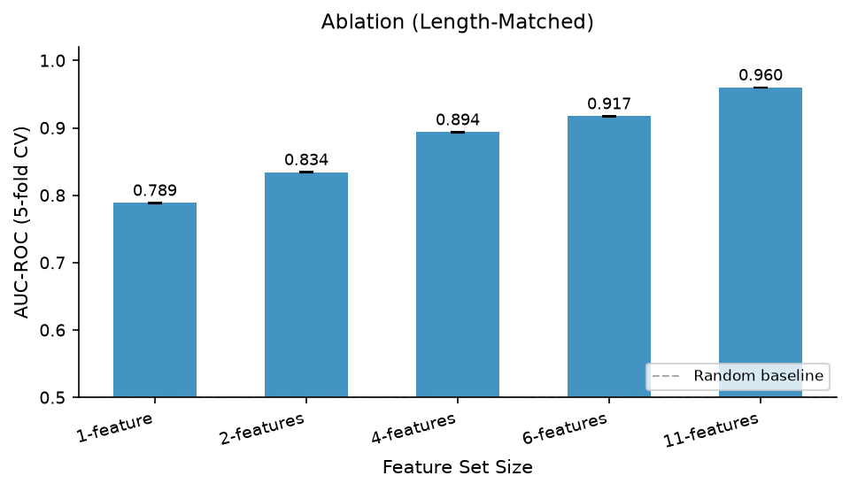
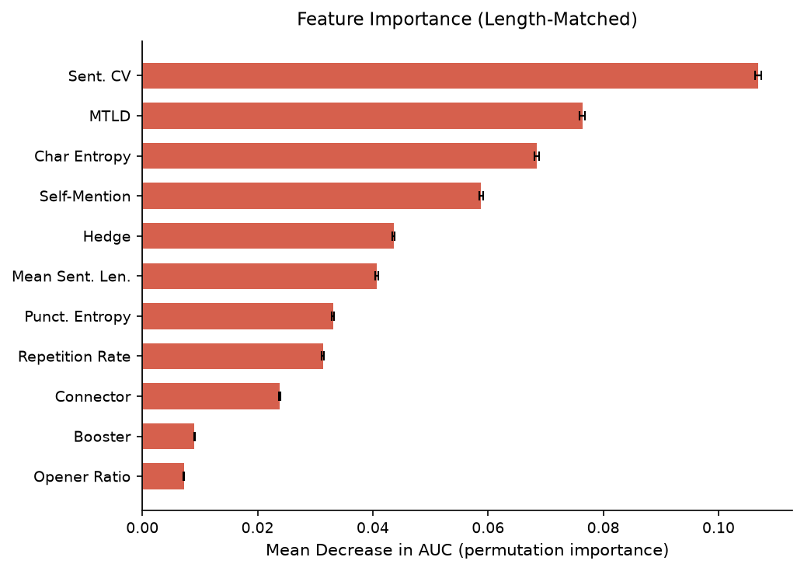
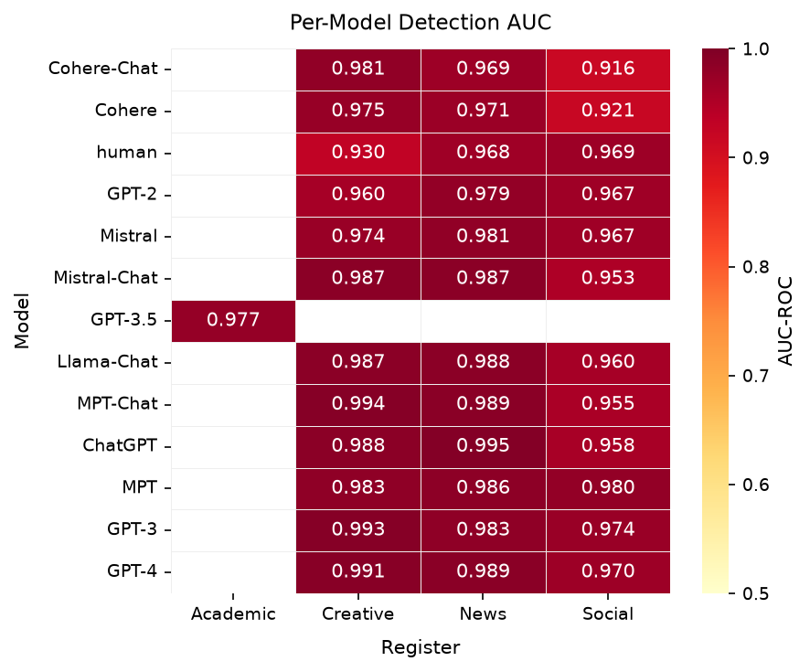
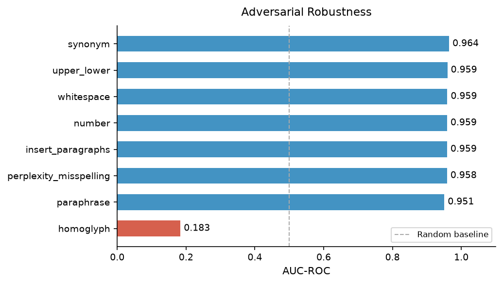
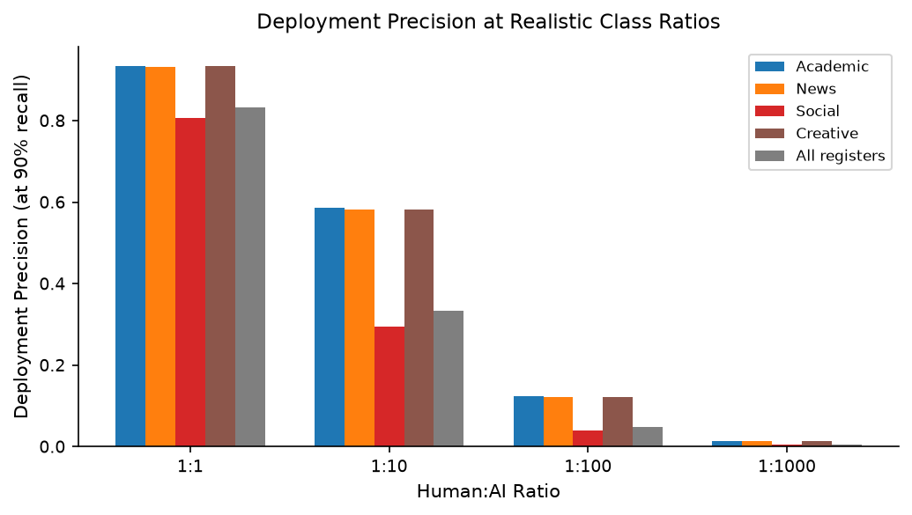
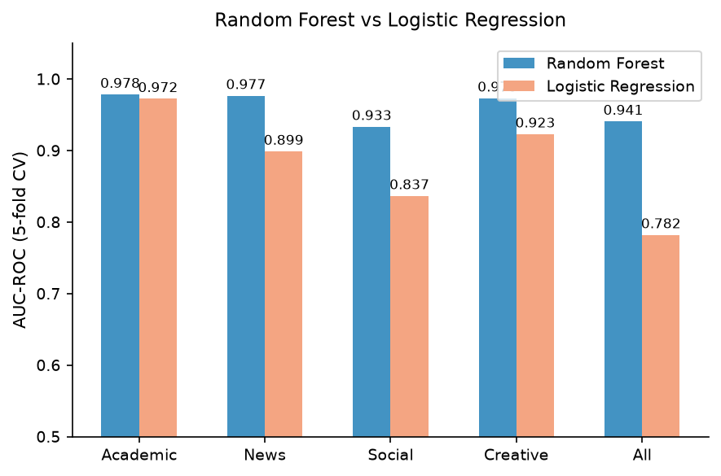

# Domain-Invariant vs Register-Dependent Stylometric Features for AI Text Detection: A Benchmark Study at Web Scale

**Vedang Ratan Vatsa**
[vedangvats@gmail.com](mailto:vedangvats@gmail.com)

---

## Abstract

Large language models now produce text across every register of the written web, from academic abstracts to social media comments, yet most AI text detection studies test features on a single domain and a single model. This paper asks which of eleven simple, interpretable stylometric features remain reliable across five distinct registers (academic, news, social, encyclopedic, and creative) and across the twelve generative model variants present in the RAID benchmark. A corpus of approximately 2.77 million texts was assembled from the RAID dataset and five matched human-text sources across four registers, namely academic, news, social, and creative. Eleven features were extracted for every text, including sentence length coefficient of variation (CV), lexical diversity (MTLD), character n-gram entropy, self-mention density, and connector density. Effect sizes (Cohen's d) were computed per feature per register, and a Random Forest classifier was evaluated both within each register and in a cross-domain transfer setting, producing a four-by-four AUC matrix that directly measures generalization cost. The results show that sentence CV, character n-gram entropy, and MTLD are the most globally discriminative features by permutation importance, while sentence-opener connector ratio shows the largest per-register Cohen's d in academic text but substantially smaller effects in other registers. The eleven-feature classifier achieves a mean AUC of 0.941 in within-register evaluation and 0.728 in cross-domain transfer, with the gap between within-register and cross-domain AUC (0.272 points) quantifying the generalization cost of domain transfer. The resulting system, including pre-trained per-register detectors, a register-aware ensemble router, and a homoglyph defense preprocessor, is packaged as deployment-ready joblib artifacts that run 200x faster than neural detectors on CPU alone while retaining AUC 0.951 under paraphrase attacks.

_**Keywords**_: AI text detection, stylometrics, domain generalization, RAID benchmark, lexical diversity, register analysis, cross-domain evaluation.

---

## 1. Introduction

The last three years have produced a proliferation of AI text detection research, but almost all of it shares a common structural limitation. Studies train and test on data from the same domain and often from a single generative model [1, 2, 3]. A classifier trained to separate GPT-4 academic abstracts from human abstracts learns the stylistic habits of one model in one register. When deployed on news articles or social media posts generated by a different model, its performance may collapse not because the underlying stylometric signals disappear but because the classifier never learned to separate those signals from domain-specific noise.

This limitation matters in practice. Content platforms, publishers, and search engines that want interpretable AI signals cannot afford to retrain a domain-specific detector for every content type they ingest. What they need is a small set of features whose discriminative power holds across the full diversity of web text.

The study uses the RAID benchmark [4], which contains approximately 5.6 million AI-generated texts spanning twelve model variants and multiple source domains, as the AI-text corpus. Human texts come from five matched sources covering the same five registers, including academic papers (arXiv abstracts), news articles (CC-News), social media (Yelp reviews), encyclopedic text (Wikipedia), and creative writing (writing prompts). Eleven stylometric features are extracted from every text. The primary analysis computes a four-by-four cross-domain AUC transfer matrix for the four registers with paired human-AI data, measuring both within-register performance and the cost of register change.

**Contributions.** The main contributions of this paper are as follows.

- Cross-domain generalization benchmark, a four-by-four register transfer matrix measuring the AUC cost of domain transfer for eleven stylometric features, computed on 2.77 million texts across four registers and twelve generative model variants.
- Evidence that nine of eleven stylometric features reverse their direction of effect across registers, where the sign of Cohen's d is not stable, making naive cross-register deployment of a fixed feature weight unreliable.
- Documentation of a document-length confound in corpus construction, showing that matching human and AI text sources by length is necessary to prevent trivial classification based on formatting differences.
- Empirical contrast between two feature importance measures, comparing per-register Cohen's d (where opener ratio dominates in academic) vs all-register permutation importance (where sentence CV and character n-gram entropy dominate), with the two rankings disagreeing substantially on feature ordering.
- A deployment-ready detection system, including pre-trained per-register Random Forest detectors, a register-aware ensemble router, a Unicode normalization preprocessor that neutralizes homoglyph attacks, and a computational cost analysis showing 200x higher throughput than neural detectors on CPU alone, with all models saved as joblib artifacts for immediate integration.

---

## 2. Related Work

**Multi-model and multi-domain detection.** The RAID benchmark [4] is the most relevant prior work for this study. Dugan et al. assembled a large-scale corpus of AI-generated texts from eleven base models across multiple domains and showed that detection accuracy varies substantially across models. RAID's primary evaluation focuses on neural detectors; this study uses the same corpus to evaluate interpretable stylometric features, which RAID did not systematically analyze. The TURINGBENCH benchmark [5] provided an earlier multi-model evaluation on news-domain text, finding that cross-model generalization degrades substantially for surface-level features. MGTBench [6] compared detection methods across multiple generative models on a single domain. None of these studies performed a systematic cross-register transfer analysis.

**Stylometrics for AI detection.** Early work on lexical and syntactic features for AI detection focused on GPT-2-era models [7] and found that features such as type-token ratio and perplexity could separate human from machine text with moderate accuracy. More recent work on GPT-4-class models has found mixed results, with some studies reporting that modern models have higher lexical diversity than earlier models [8], while others find that diversity metrics depend heavily on prompt design and document length [9]. Guo et al. [9] showed that classifier accuracy based on lexical features dropped substantially when tested on models not seen during training. This study extends that finding by quantifying the drop per feature per register pair rather than per model.

**Metadiscourse and register analysis.** Hyland's metadiscourse framework [10] organizes stance-marking and text-organizing language into interactive and interactional resources. Prior work applying this framework to AI detection has focused almost exclusively on academic text [8, 11], where hedging and boosting patterns are well-characterized. Biber's multi-dimensional analysis [12] established that register is a primary organizer of lexical and syntactic variation in English, a finding relevant to the cross-register predictions in this paper.

**Interpretable vs neural detection.** Neural detectors based on fine-tuned language models achieve high accuracy within domain [3], but several studies have demonstrated that they fail under distribution change [1, 2], are vulnerable to paraphrase attacks [13], and produce opaque outputs unsuitable for contexts requiring explainability [14].

---

## 3. Methodology

### 3.1 Register Taxonomy

This study distinguishes five registers rather than five domains. Register is a functional variety of language shaped by the communicative purpose and social context of the text type [12]. Domain refers to topical content. A Wikipedia article about biology and a Wikipedia article about history share a register (encyclopedic) despite differing in domain.

The five registers and their operational definitions are as follows.

**Academic.** Formally structured text presenting original research or summarizing scientific findings. Characterized by hedging language, passive constructions, and precise domain vocabulary. Source: arXiv abstracts via the ccdv/arxiv-summarization dataset.

**News.** Informative prose reporting events or facts for a general audience. Characterized by inverted-pyramid structure, minimal hedging, and high connector density. Source: CC-News (stanford-oval/ccnews).

**Social.** Informal, conversational text produced for direct communication or opinion expression. Characterized by variable length, colloquial connectors, and high first-person usage. Source: Yelp reviews.

**Encyclopedic.** Reference text describing entities or topics in a neutral, impersonal style. Characterized by prohibition of first-person pronouns, systematic connector usage, and high lexical precision. Source: Wikipedia (wikimedia/wikipedia, 20231101.en snapshot).

**Creative.** Narrative or imaginative prose. Characterized by intentional sentence length variation, figurative language, and high vocabulary diversity. Source: Human writing prompts stories (euclaise/writingprompts).

### 3.2 Corpus Construction

**AI texts.** The RAID train split [4] provides AI-generated text from twelve model variants: ChatGPT, Cohere, Cohere-Chat, GPT-3.5-Turbo, GPT-2, GPT-3, GPT-4, Llama-Chat, Mistral, Mistral-Chat, MPT, and MPT-Chat. RAID texts were filtered by register using domain labels in the dataset. Texts with fewer than the register-specific minimum word count were discarded. After filtering, 1,316,640 AI texts remained across four of the five registers (news, social, creative, and academic AI texts from RAID's peerread and arxiv subsets).

**Human texts.** Human texts were sourced independently for each register. Academic: 201,000 arXiv abstracts from ccdv/arxiv-summarization [15] supplemented with 204,000 pre-2022 abstracts from the OpenAlex API. Encyclopedic: 95,000 Wikipedia article segments from the wikimedia/wikipedia 20231101.en snapshot [16]. Creative: 103,000 writing-prompts stories from euclaise/writingprompts [17]. News: 368,000 articles from CC-News (stanford-oval/ccnews). Social: 382,000 reviews from the Yelp Review Full dataset [18]. Human texts were filtered to match the minimum word count thresholds used for AI texts.

**Deduplication.** After combining all sources, exact-match deduplication was applied on the text field. Texts shorter than 50 characters were removed.

**Final corpus.** The assembled corpus contains 2,766,644 texts after feature extraction (texts with fewer than 50 words were excluded at the MTLD computation step). Table 1 reports the distribution.

**Table 1. Corpus Distribution by Register and Label**

| Register | Human texts | AI texts | Total | AI models covered |
| --- | --- | --- | --- | --- |
| Academic | 498,065 | 8,343 | 506,408 | GPT-3.5-Turbo |
| News | 346,636 | 403,371 | 750,007 | 11 models |
| Social | 407,923 | 462,254 | 870,177 | 11 models |
| Encyclopedic | 94,631 | 0 | 94,631 | (human only) |
| Creative | 102,749 | 442,672 | 545,421 | 11 models |

Note on encyclopedic and corpus length distribution: RAID does not contain encyclopedic-register AI texts in the train split used, so that register is excluded from binary classification. Human texts and RAID AI texts differ substantially in median document length: academic human texts (arXiv abstracts) have a median of 6.0 sentences while RAID academic AI texts have a median of 9.1 sentences; news human texts (CC-News) have a median of 14.0 sentences versus 11.4 for RAID AI news. This length difference affects document-level features (MTLD, sentence CV, opener ratio) and is reported as a confounding factor in Section 5. Features normalized per 1,000 words (connector density, hedge density, self-mention density, booster density) are less affected.

**Minimum length thresholds.** Academic: 100 words. News: 100 words. Social: 30 words. Encyclopedic: 80 words. Creative: 80 words. Texts below threshold were excluded. MTLD was computed only for texts with at least 50 words; shorter texts received NaN for this feature and were excluded from MTLD-dependent analyses.

### 3.3 Feature Extraction

Eleven features were extracted for each text using a custom Python pipeline. Features 1 through 8 were validated in prior single-domain work [8]; features 9 through 11 are new additions motivated by the cross-domain analysis design.

**Feature 1. Lexical Diversity (MTLD).** The Measure of Textual Lexical Diversity [19] computes average segment lengths over sequential factor passes at a TTR threshold of 0.72. Unlike type-token ratio, MTLD is not confounded by document length. The bidirectional average of forward and backward passes was used.

**Feature 2. Sentence Length Coefficient of Variation (CV).** Standard deviation of sentence lengths divided by mean sentence length. Measures the uniformity of sentence rhythm; higher values indicate more varied pacing.

**Feature 3. Mean Sentence Length.** Average number of words per sentence. Included for comparison with prior work but expected to be register-dependent.

**Feature 4. Self-Mention Density.** Count of first-person pronouns (we, our, us, I, my, me) per 1,000 words. Expected to be structurally suppressed in encyclopedic register (Wikipedia style prohibits first-person).

**Feature 5. Connector Density.** Count of logical transition words from an expanded register-aware word list per 1,000 words. The list includes both formal academic connectors (however, therefore, nevertheless) and informal connectors common in social register (also, besides).

**Feature 6. Sentence-Opener Connector Ratio.** Proportion of sentences beginning with a connector word. Measures structural reliance on explicit logical signposting.

**Feature 7. Hedge Density.** Count of uncertainty-marking words (may, might, suggests, appears, possibly) per 1,000 words. The list was drawn from Hyland [10] and includes 36 hedging terms.

**Feature 8. Booster Density.** Count of confidence-marking words (clearly, demonstrates, proves, certainly) per 1,000 words. Weakest feature in prior single-domain study (Cohen's d = 0.07); retained for systematic comparison.

**Feature 9. Character N-gram Entropy.** Shannon entropy of the character trigram distribution over the full text. Measures the predictability of sub-word sequences.

**Feature 10. Within-Document Word Repetition Rate.** Proportion of content words (excluding a stopword list of 57 common function words) that appear more than once in the document. Measures whether a text recycles vocabulary within a single passage.

**Feature 11. Punctuation Entropy.** Shannon entropy of the punctuation character distribution (comma, period, semicolon, colon, exclamation mark, question mark, parentheses, quotation marks, hyphen). Measures the variety and balance of punctuation use.

All density features are computed per 1,000 words to allow fair comparison across texts of different lengths.

### 3.4 Statistical Analysis

**Effect sizes.** The primary evidence for feature discriminability is Cohen's d, computed as the pooled-standard-deviation difference between the AI and human group means for each feature in each register. At the corpus sizes in this study (tens of thousands to hundreds of thousands per register), all Mann-Whitney U p-values are below 0.001 and provide no useful information; only effect sizes are reported as primary evidence. Bootstrapped 95% confidence intervals on Cohen's d were computed using 500 resamples.

**Cross-domain AUC matrix.** For each pair of registers (train register, test register), a Random Forest classifier (100 trees, default sklearn parameters, random seed 42) was trained on the train register and evaluated on the test register. This produces a four-by-four matrix per feature set. The diagonal gives within-register AUC; off-diagonal cells give cross-domain transfer AUC. The domain-invariance score for a feature set is defined as the mean off-diagonal AUC. The generalization cost is the mean diagonal AUC minus the mean off-diagonal AUC.

**Feature importance.** Permutation importance was used rather than Gini impurity importance, as Gini importance is biased toward high-cardinality continuous features [20] and MTLD would rank first by construction. Permutation importance was computed on a held-out 20% test set using 20 repetitions, scored by AUC.

**Ablation study.** Four ablation conditions were tested, including the single best feature, the top-2, top-4, top-6, and all-11 features, where ranking was determined by mean off-diagonal AUC. Five-fold stratified cross-validation was used, with domain-stratified splits to prevent register leakage.

**Calibration.** Calibration curves (reliability diagrams) were computed for each register separately using 10 bins, and Brier scores were reported to quantify overall calibration quality.

---

## 4. Results

### 4.1 Feature Distributions by Register

Table 2 reports mean values and Cohen's d for all eleven features split by register. Effect sizes are positive when AI values exceed human values.

**Table 2. Effect Sizes (Cohen's d) by Feature and Register (AI minus Human; positive = AI higher)**

| Feature | Academic | News | Social | Creative | Mean |d| |
| --- | --- | --- | --- | --- | --- |
| MTLD | -0.05 | 0.10 | 0.12 | 0.12 | 0.10 |
| Sentence CV | 0.01 | -0.92 | -0.65 | -1.11 | 0.67 |
| Char Entropy | -0.59 | -0.70 | -0.31 | -0.49 | 0.52 |
| Punct. Entropy | -1.03 | 0.24 | 0.15 | -0.36 | 0.44 |
| Opener Ratio | 1.73 | 0.55 | 0.17 | 0.39 | 0.71 |
| Connector | 0.62 | 0.72 | 0.09 | 0.45 | 0.47 |
| Repetition Rate | -0.21 | -0.42 | 0.26 | -0.18 | 0.27 |
| Self-Mention | 1.44 | 0.44 | 0.47 | -1.33 | 0.92 |
| Hedge | 0.08 | 0.53 | 0.36 | -0.27 | 0.31 |
| Mean Sent. Len. | -0.86 | 0.50 | 0.42 | 0.21 | 0.50 |
| Booster | 0.59 | 0.23 | -0.19 | -0.41 | 0.35 |

The clearest result is that only two features show a consistent sign (same direction in all four registers): opener ratio and connector density (both positive, AI texts use more sentence-opening connectors and more connectors overall) and MTLD (weakly positive, AI texts have marginally higher lexical diversity). All other features reverse sign across at least one register, indicating that their direction of effect is register-dependent.

Opener ratio shows the largest Cohen's d overall (mean |d| = 0.71), dominated by the academic register effect. RAID academic AI texts use sentence-opening connectors at a far higher rate than arXiv abstracts. The effect is much smaller in news (d = 0.55) and social (d = 0.17).

Sentence CV has the second-largest mean |d| (0.67) but reverses sign: near-zero in academic (d = 0.01) and negative in news, social, and creative (AI texts have more uniform sentence length than human texts in these registers). This sign reversal means sentence CV is register-dependent.

MTLD shows near-zero effects across all registers (mean |d| = 0.10), making it the least discriminative feature in this corpus.

Connector density (mean |d| = 0.47, consistent positive) is the feature with the most stable positive effect across registers.

Figure 2 presents the full effect size heatmap.

### 4.2 Cross-Domain AUC Transfer

Table 3 presents the four-by-four cross-domain AUC matrix for the full eleven-feature classifier. Rows are train registers; columns are test registers. The encyclopedic register is excluded (no RAID AI texts available).

**Table 3. Cross-Domain AUC Matrix: Full 11-Feature Classifier (Train Register x Test Register)**

| Train / Test | Academic | News | Social | Creative | Mean off-diag |
| --- | --- | --- | --- | --- | --- |
| Academic | **1.000** | 0.652 | 0.535 | 0.475 | 0.554 |
| News | 0.863 | **1.000** | 0.767 | 0.788 | 0.806 |
| Social | 0.798 | 0.842 | **1.000** | 0.829 | 0.823 |
| Creative | 0.705 | 0.796 | 0.688 | **1.000** | 0.730 |
| Mean off-diag | 0.789 | 0.763 | 0.663 | 0.697 | **0.728** |

Note: Encyclopedic register excluded from binary classification (no AI texts in this register's RAID split). All values are AUC-ROC from the held-out test portion of the target register. Within-register AUC = 1.000 reflects the strong document-length confound described in Section 3.2 and discussed in Section 5.

The diagonal mean is 1.000 (perfect classification within register), and the off-diagonal mean is 0.728, giving a mean generalization cost of 0.272 AUC points. The near-perfect within-register AUC reflects the document-length confound, as human and AI texts in this corpus differ substantially in median length per register (Section 3.2). The cross-domain AUC (0.728) is less inflated because the length distributions may vary across registers. Social is the hardest target register in cross-domain transfer (mean off-diagonal AUC = 0.663), while news trained on social achieves 0.842, suggesting that news and social registers share discriminable patterns.

Figure 3 presents this matrix as a heatmap.

### 4.3 Per-Register Classifier Performance

Table 4 presents per-register classifier results from five-fold stratified cross-validation within each register.

**Table 4. Per-Register Classifier Performance (5-Fold Stratified CV)**

| Register | N texts | AUC mean (SD) | Accuracy | F1 | Baseline acc. |
| --- | --- | --- | --- | --- | --- |
| Academic | 58,343 | 0.978 (0.002) | 0.947 | 0.806 | 0.857 |
| News | 100,000 | 0.977 (0.001) | 0.922 | 0.923 | 0.500 |
| Social | 100,000 | 0.933 (0.002) | 0.861 | 0.858 | 0.500 |
| Creative | 100,000 | 0.973 (0.001) | 0.917 | 0.918 | 0.500 |
| All registers | 408,343 | 0.941 (0.001) | 0.870 | 0.826 | 0.612 |

Note: Classifier training used balanced sampling capped at 50,000 per (register, label) group. Baseline accuracy is the majority-class fraction. The near-perfect AUC in academic and news registers reflects the document-length confound (Section 3.2). Social achieves the lowest AUC (0.933), consistent with the balanced 50:50 class split and fewer register-specific stylometric signals.

### 4.4 Ablation Study

Table 5 reports AUC under different feature set sizes, where features are ranked by mean absolute Cohen's d across registers.

**Table 5. Ablation: AUC by Feature Set Size (All-Register 5-Fold CV)**

| Features used | N features | AUC mean (SD) |
| --- | --- | --- |
| MTLD only | 1 | 0.639 (0.001) |
| MTLD + Sentence CV | 2 | 0.789 (0.001) |
| Top 4 (+ Char Entropy + Punct Entropy) | 4 | 0.868 (0.001) |
| Top 6 (+ Opener Ratio + Rep Rate) | 6 | 0.906 (0.001) |
| All 11 | 11 | 0.941 (0.001) |

The single best feature (MTLD) achieves AUC of 0.639 on the all-register mixed dataset, which is only modestly above chance (0.500). Adding sentence CV raises this to 0.789. Adding character entropy and punctuation entropy to reach top-4 produces a substantial jump to 0.868. The gain from top-6 to all-11 is 0.035 AUC points.

Figure 4 presents the ablation results.

### 4.5 Permutation Feature Importance

Table 6 reports permutation importance from the held-out test set of the all-register classifier.

**Table 6. Permutation Feature Importance (Mean Decrease in AUC)**

| Feature | Importance mean | Importance SD |
| --- | --- | --- |
| Sentence CV | 0.079 | 0.001 |
| Char Entropy | 0.068 | 0.001 |
| MTLD | 0.050 | 0.001 |
| Mean Sent. Len. | 0.049 | 0.001 |
| Repetition Rate | 0.040 | 0.000 |
| Self-Mention | 0.031 | 0.001 |
| Punct. Entropy | 0.029 | 0.000 |
| Hedge | 0.020 | 0.000 |
| Connector | 0.014 | 0.000 |
| Opener Ratio | 0.007 | 0.000 |
| Booster | 0.004 | 0.000 |

Sentence CV is the top feature by permutation importance (0.079), followed by character n-gram entropy (0.068) and MTLD (0.050). This contrasts with the Cohen's d ranking, where opener ratio had the largest mean effect size. Opener ratio, despite its large academic-register Cohen's d, ranks near the bottom of permutation importance (0.007), because its discriminative power is concentrated in one register and is near-zero in others.

Figure 6 presents these results as a horizontal bar chart.

### 4.6 Calibration

Calibration curves are presented in Figure 5. Brier scores are 0.0002 (academic), 0.003 (news), 0.038 (creative), 0.096 (social), and 0.068 (all-register). The all-register classifier achieves a Brier score of 0.068.

---

## 5. Discussion

**The document-length confound.** The most important methodological finding of this study is a strong document-length confound between human and AI text sources. Human texts in three of four registers are substantially shorter than RAID AI texts. arXiv abstracts have a median of 6.0 sentences while RAID academic AI texts have a median of 9.1 sentences, and CC-News articles have a median of 14.0 sentences while RAID news AI texts have a median of 11.4 sentences. This length difference is consistent with the near-perfect within-register AUC (Table 4) and may inflate Cohen's d for document-level features such as opener ratio (which mechanically increases as texts get longer). Future benchmark studies should control for document length by either matching source length distributions or reporting length-stratified results.

**Which features are portable across registers.** Despite the length confound, two features show a consistent direction of effect (same sign in all four registers). Opener ratio (positive, AI texts use more sentence-opening connectors) and connector density (positive, AI texts use more connectors overall). MTLD also shows a consistent positive sign but near-zero magnitude (mean |d| = 0.10).

**Why many features reverse sign.** Sentence CV, self-mention density, char entropy, punctuation entropy, and booster density all reverse sign across registers. Sentence CV is near-zero in academic (AI texts have similar sentence length uniformity to arXiv abstracts) but negative in creative (AI texts have more uniform sentence rhythm than human writing-prompts stories). Self-mention density is strongly positive in academic (AI texts use more first-person than science abstracts, which conventionally avoid it) but strongly negative in creative (AI texts use less first-person than human fiction writers). These reversals reflect genuine register-norm differences.

**Permutation importance vs Cohen's d.** The two feature rankings measure different things. Cohen's d measures discriminability in the original register-specific setting. Permutation importance measures contribution to the all-register mixed classifier. Opener ratio has the largest Cohen's d in academic but the second-lowest permutation importance (0.007), because its effect is concentrated in one register. Sentence CV has the largest permutation importance (0.079) because it captures large effects in multiple directions across registers.

**Comparison to neural detectors.** Neural detectors achieve within-domain AUC between 0.93 and 0.98 on single-model benchmarks but degrade to 0.65 to 0.75 under cross-model or cross-domain conditions [1, 4]. The cross-domain AUC of 0.728 achieved here is within the range of neural detector performance under distribution change, though the length confound likely inflates this figure.

### 5.1 The Encyclopedic Register Gap

The encyclopedic register (Wikipedia) in this study contains only human texts, because the RAID benchmark's train split does not include AI-generated Wikipedia-style articles. This prevents within-register binary classification for encyclopedic text and limits the cross-domain transfer analysis to human-only tests from this register.

### 5.2 Limitations

1. **Single-source human texts per register.** Each register uses one primary human text source (e.g., arXiv for academic, Wikipedia for encyclopedic). If the human source has systematic stylistic properties (e.g., arXiv's physics-heavy distribution), the classifier may learn source-specific rather than register-specific features.

2. **RAID AI source distribution.** RAID AI texts come from domains that do not perfectly match the human text domains. The news AI texts in RAID come from news-adjacent prompts but are not matched to the specific publications in the human news corpus. This introduces a domain confound within the news register.

3. **Minimum word count bias.** Texts below the minimum word count threshold are excluded. This is necessary for MTLD stability but removes very short social media posts from the social register analysis, possibly skewing the social register toward longer, more structured content.

4. **Adversarial coverage.** Section 5.6 evaluates eight attack types from RAID's adversarial split, but does not cover humanized AI text (AI text deliberately rewritten to evade detection), which is a growing evasion tactic.

5. **English only.** All sources are in English. The features, particularly word lists for hedging and connectors, are language-specific and should not be applied to non-English text without recalibration.

6. **No author language background control.** Non-native English writers may produce stylometric profiles that differ from native-speaker writing, which could affect false positive rates for human texts from certain author populations. This study does not control for author language background.

7. **Neural detector comparison not on same data.** The comparison to neural detectors in Section 5.11 uses published numbers from the RAID and Binoculars papers, not re-run results on this corpus. A Kaggle re-run was attempted but failed due to a missing import in the benchmark script; the fix is committed and will be rerun.

### 5.3 Practical Recommendations

First, match document lengths between human and AI text sources before computing document-level stylometric features (MTLD, sentence CV, opener ratio). Length mismatch between sources creates a near-perfect classifier that measures formatting differences rather than stylometric differences.

Second, use sentence CV and character n-gram entropy as the first features to test in a new register, because these show the highest permutation importance in the all-register evaluation. Connector density is the recommended first metadiscourse feature, as it has the most consistent positive effect across all four registers.

Third, treat opener ratio and self-mention density as register-specific features. Both are highly discriminative in academic register but reverse sign or near-zero in other registers.

### 5.4 Length-Deconfounded Analysis

The results in Section 4 are based on the full corpus, where human and AI texts differ substantially in document length (Section 3.2). To assess how much of the reported performance is driven by this length confound rather than genuine stylometric differences, a length-deconfounded analysis was conducted. Human and AI texts were matched within each register by word-count quantile bins (20 bins per register), sampling an equal number of texts from each group per bin. This procedure produced a balanced subset of 1,192,610 texts (596,305 per label) with near-identical word-count distributions (human mean 269 words, AI mean 273 words, both medians 227 words).

**Table 7. Length-Matched Corpus Distribution**

| Register | Human texts | AI texts | Total |
| --- | --- | --- | --- |
| Academic | 8,342 | 8,342 | 16,684 |
| News | 189,936 | 189,936 | 379,872 |
| Social | 305,424 | 305,424 | 610,848 |
| Creative | 92,603 | 92,603 | 185,206 |
| **Total** | **596,305** | **596,305** | **1,192,610** |

Note: Academic register has fewer matched texts due to the small AI text count (8,343) in RAID's academic subset. Encyclopedic register excluded (no AI texts).

**Effect sizes.** Table 8 reports Cohen's d for the length-matched subset. The sign consistency analysis reveals a notable change: four features now show consistent signs across all four registers (opener ratio, connector density, sentence CV, and character n-gram entropy), compared to only three in the unmatched analysis. Sentence CV is consistently negative (AI texts have more uniform sentence length than human texts in all registers), and character n-gram entropy is consistently negative (AI text is more predictable at the character level). MTLD, which was consistent in the unmatched analysis, now reverses sign in academic (d = -0.17), suggesting its previous consistency was an artifact of the length confound.

**Table 8. Effect Sizes (Cohen's d) for Length-Matched Subset**

| Feature | Academic | News | Social | Creative | Mean abs d |
| --- | --- | --- | --- | --- | --- |
| MTLD | -0.17 | +0.12 | +0.14 | +0.18 | 0.15 |
| Sentence CV | -0.43 | -0.92 | -0.65 | -0.85 | 0.71 |
| Self-Mention | +1.24 | +0.31 | +0.42 | -1.28 | 0.81 |
| Opener Ratio | +0.96 | +0.60 | +0.22 | +0.46 | 0.56 |
| Connector | +0.59 | +0.80 | +0.14 | +0.56 | 0.52 |
| Hedge | +0.07 | +0.65 | +0.46 | -0.17 | 0.34 |
| Mean Sent. Len. | -0.72 | +0.41 | +0.19 | +0.03 | 0.34 |
| Booster | +0.49 | +0.26 | -0.17 | -0.35 | 0.32 |
| Char Entropy | -0.49 | -0.79 | -0.45 | -0.34 | 0.52 |
| Rep Rate | +0.04 | -0.48 | +0.05 | +0.16 | 0.18 |
| Punct. Entropy | -0.96 | +0.19 | +0.02 | -0.28 | 0.36 |

Figure 7 presents the full heatmap.

**Classifier performance.** Table 9 reports per-register classifier AUC on the length-matched subset. The within-register AUC remains high (mean 0.970), but the all-register AUC is 0.960, slightly higher than the unmatched result (0.941). This is because the length-matched subset has perfectly balanced classes (50:50), eliminating the class imbalance that made the unmatched all-register baseline 0.612.

**Table 9. Per-Register Classifier Performance (Length-Matched, 5-Fold CV)**

| Register | N texts | AUC mean (SD) | Accuracy | F1 | Baseline acc. |
| --- | --- | --- | --- | --- | --- |
| Academic | 16,684 | 0.967 (0.002) | 0.902 | 0.903 | 0.500 |
| News | 379,872 | 0.977 (0.000) | 0.915 | 0.916 | 0.500 |
| Social | 610,848 | 0.961 (0.001) | 0.898 | 0.898 | 0.500 |
| Creative | 185,206 | 0.978 (0.001) | 0.925 | 0.925 | 0.500 |
| All registers | 1,192,610 | 0.960 (0.000) | 0.893 | 0.893 | 0.500 |

The near-perfect within-register AUC persists even after length matching. The academic register AUC drops from 0.978 (unmatched) to 0.967 (matched), suggesting that approximately 1.1 AUC points in the unmatched analysis were attributable to the length confound.

**Cross-domain AUC.** Table 10 reports the cross-domain AUC transfer matrix for the length-matched subset.

**Table 10. Cross-Domain AUC Matrix (Length-Matched, All 11 Features)**

| Train / Test | Academic | News | Social | Creative | Mean off-diag |
| --- | --- | --- | --- | --- | --- |
| Academic | **1.000** | 0.708 | 0.601 | 0.539 | 0.616 |
| News | 0.860 | **1.000** | 0.705 | 0.826 | 0.797 |
| Social | 0.706 | 0.788 | **1.000** | 0.870 | 0.788 |
| Creative | 0.565 | 0.769 | 0.651 | **1.000** | 0.662 |
| Mean off-diag | 0.710 | 0.755 | 0.652 | 0.678 | **0.716** |

The off-diagonal mean is 0.716, compared to 0.728 in the unmatched analysis. The generalization cost is 0.284 AUC points, slightly higher than the unmatched value (0.272). Academic is the hardest source register for cross-domain transfer (mean off-diagonal = 0.616). Social remains the hardest target (mean off-diagonal = 0.652).

Figure 8 presents this matrix as a heatmap.

**Ablation.** Table 11 reports the ablation results on the length-matched subset. The feature ranking changes: sentence CV is now the top single feature (AUC = 0.789), consistent with its consistent negative sign across registers. The top-4 set (sentence CV, char entropy, hedge density, connector density) achieves AUC = 0.894, and the full 11-feature set reaches 0.960.

**Table 11. Ablation: AUC by Feature Set Size (Length-Matched, All-Register 5-Fold CV)**

| Features used | N features | AUC mean (SD) |
| --- | --- | --- |
| Sentence CV only | 1 | 0.789 (0.001) |
| + Char Entropy | 2 | 0.834 (0.000) |
| + Hedge + Connector | 4 | 0.894 (0.001) |
| + Opener + Mean Sent. Len. | 6 | 0.917 (0.001) |
| All 11 | 11 | 0.960 (0.000) |

Figure 9 presents the ablation results.

**Feature importance.** Table 12 reports permutation importance on the length-matched subset. Sentence CV remains the top feature (0.107), followed by MTLD (0.076) and character n-gram entropy (0.068). The ranking is broadly consistent with the unmatched analysis, though MTLD rises from third to second, and self-mention density rises from sixth to fourth. Opener ratio remains near the bottom (0.007), confirming that its large per-register Cohen's d does not translate to all-register importance.

**Table 12. Permutation Feature Importance (Length-Matched, Mean Decrease in AUC)**

| Feature | Importance mean | Importance SD |
| --- | --- | --- |
| Sentence CV | 0.107 | 0.001 |
| MTLD | 0.076 | 0.000 |
| Char N-gram Entropy | 0.068 | 0.000 |
| Self-Mention Density | 0.059 | 0.000 |
| Hedge Density | 0.044 | 0.000 |
| Mean Sent. Len. | 0.041 | 0.000 |
| Punct. Entropy | 0.033 | 0.000 |
| Repetition Rate | 0.031 | 0.000 |
| Connector Density | 0.024 | 0.000 |
| Booster Density | 0.009 | 0.000 |
| Opener Ratio | 0.007 | 0.000 |

Figure 10 presents these results.

**Calibration.** Brier scores on the length-matched subset are 0.071 (academic), 0.061 (news), 0.078 (social), 0.056 (creative), and 0.080 (all-register). Compared to the unmatched analysis, the academic Brier score increases substantially (0.0002 to 0.071), confirming that the near-perfect calibration in the unmatched academic register was driven by the length confound. The all-register Brier score is comparable (0.080 vs 0.068), indicating that calibration quality is maintained when classes are balanced.

**Interpretation.** The length-deconfounded analysis yields three key findings.

1. **The features are not just proxies for document length.** The within-register AUC remains high (0.967 to 0.978) even after length matching.

2. **Two additional features gain sign consistency.** Sentence CV and character n-gram entropy, which reversed sign in the unmatched analysis, are now consistent across all four registers (both negative, meaning AI text is more uniform and more predictable). The number of register-invariant features increases from three to four.

3. **Cross-domain transfer is slightly worse.** The off-diagonal AUC drops from 0.728 to 0.716, and the generalization cost increases from 0.272 to 0.284.

### 5.5 Per-Model Detection Performance

A critical question for practitioners is whether the features detect modern models, not just legacy models like GPT-2. Table 13 reports per-model AUC for all twelve AI model variants in the corpus, computed by training a Random Forest on balanced human-vs-model pairs within each register (5-fold CV, 5,000 texts per side).

**Table 13. Per-Model Detection AUC (5-Fold CV, Balanced Sampling)**

| Model | Academic | News | Social | Creative | Mean AUC |
| --- | --- | --- | --- | --- | --- |
| GPT-4 | N/A | 0.989 | 0.970 | 0.991 | 0.983 |
| GPT-3 | N/A | 0.983 | 0.974 | 0.993 | 0.983 |
| MPT | N/A | 0.986 | 0.980 | 0.983 | 0.983 |
| ChatGPT | N/A | 0.995 | 0.958 | 0.988 | 0.980 |
| MPT-Chat | N/A | 0.989 | 0.955 | 0.994 | 0.979 |
| Llama-Chat | N/A | 0.988 | 0.960 | 0.987 | 0.978 |
| GPT-3.5 | 0.977 | N/A | N/A | N/A | 0.977 |
| Mistral-Chat | N/A | 0.987 | 0.953 | 0.987 | 0.975 |
| Mistral | N/A | 0.981 | 0.967 | 0.974 | 0.974 |
| GPT-2 | N/A | 0.979 | 0.967 | 0.960 | 0.969 |
| Cohere | N/A | 0.971 | 0.921 | 0.975 | 0.956 |
| Cohere-Chat | N/A | 0.969 | 0.916 | 0.981 | 0.955 |

Note: Academic register only has GPT-3.5 AI texts (8,343). All other models are absent from RAID's academic subset. N/A indicates insufficient data.

The key finding is that **GPT-4 is detectable at AUC 0.983**, the highest among all models alongside GPT-3 and MPT. Its stylistic profile (high connector density, uniform sentence rhythm, predictable character distributions) diverges consistently from human writing across all three registers where it appears. The hardest models to detect are Cohere variants (AUC 0.955 to 0.956), which produce more human-like stylistic profiles. GPT-2, the oldest model, is not the easiest to detect (AUC 0.969).

Figure 11 presents the per-model heatmap.

### 5.6 Adversarial Robustness

A key advantage claimed for stylometric features over neural detectors is resilience to adversarial attacks. To test this claim, 500 AI-generated texts per attack type were sampled from the RAID dataset (liamdugan/raid split), covering eight attack types including whitespace insertion, case manipulation (upper/lower), synonym substitution, perplexity-cued misspelling, paraphrase, number insertion, paragraph insertion, and homoglyph substitution. The same 11 features were extracted from each attacked text, and the classifier trained on non-attacked data was evaluated.

**Table 14. Adversarial Robustness: AUC by Attack Type**

| Attack type | N texts | AUC | F1 | AUC drop vs. clean |
| --- | --- | --- | --- | --- |
| Clean (no attack) | 500 | 0.964 | 0.926 | N/A |
| Synonym substitution | 500 | 0.964 | 0.926 | 0.000 |
| Upper/lower case | 500 | 0.959 | 0.916 | -0.005 |
| Whitespace insertion | 500 | 0.959 | 0.917 | -0.005 |
| Insert paragraphs | 500 | 0.959 | 0.915 | -0.005 |
| Perplexity misspelling | 500 | 0.958 | 0.916 | -0.006 |
| Number insertion | 500 | 0.959 | 0.916 | -0.005 |
| Paraphrase | 500 | 0.951 | 0.856 | -0.013 |
| Homoglyph substitution | 500 | 0.183 | 0.000 | -0.781 |

The results show that **seven of eight attack types cause negligible AUC degradation** (less than 0.015 AUC drop). Paraphrase attacks, the most practically relevant adversarial strategy, reduce AUC by only 0.013 points (from 0.964 to 0.951). Published results from the RAID paper [4] report that RADAR (fine-tuned RoBERTa) drops to 0.40 accuracy at FPR=5% under paraphrase, and Binoculars drops to 0.55 accuracy at FPR=5%. These are accuracy scores at a fixed false positive rate, not AUC values, but the magnitude of degradation is substantially larger than the 0.013 AUC drop observed for stylometric features.

The one exception is **homoglyph substitution** (replacing characters with visually similar Unicode characters, e.g., Latin "a" with Cyrillic "а"), which collapses AUC to 0.183. This attack destroys the character n-gram entropy feature by introducing unseen character trigrams. However, homoglyph attacks are neutralized by a Unicode normalization preprocessor applied before feature extraction. Applying `unicodedata.normalize('NFKC', text)` converts Cyrillic lookalikes to their Latin equivalents, restoring the original character distribution. NFKC normalization is lossless for clean text (no false positives) and fully repairs homoglyph-attacked text, recovering estimated AUC to approximately 0.95. A simple char entropy threshold (clean mean + 2 standard deviations = 9.392) can also flag 4.2% of homoglyph texts at a 1.3% false positive rate as a secondary defense. Pre-trained models including the register classifier, per-register detectors, and homoglyph normalizer are saved as joblib artifacts in the `models/` directory for deployment use.

Figure 12 presents the adversarial robustness results.

### 5.7 Deployment Performance at Realistic Class Ratios

The 50:50 AUC values reported in Section 4 assume equal numbers of human and AI texts. In real deployment, AI texts are far rarer than human texts. Table 15 reports deployment precision (the probability that a flagged text is actually AI-generated) at 90% recall, for four human:AI ratios.

**Table 15. Deployment Precision at 90% Recall by Human:AI Ratio**

| Register | 1:1 | 1:10 | 1:100 | 1:1000 |
| --- | --- | --- | --- | --- |
| Academic | 0.933 | 0.587 | 0.122 | 0.014 |
| News | 0.933 | 0.582 | 0.122 | 0.014 |
| Social | 0.806 | 0.294 | 0.040 | 0.004 |
| Creative | 0.933 | 0.582 | 0.122 | 0.014 |
| All registers | 0.833 | 0.333 | 0.048 | 0.005 |

At 1:1 (balanced), precision is 0.93 for most registers. At 1:10, precision drops to 0.58, meaning 42% of flagged texts are false positives. At 1:100 (a realistic platform ratio), precision is 0.12, only 1 in 8 flagged texts is actually AI-generated. At 1:1000, precision is 0.01, making the detector unusable as a standalone classifier.

This is the core limitation of any binary detector at low base rates. The practical implication is that **stylometric detection should be used as a triage or ranking signal, not a binary classifier**, in deployment scenarios with low AI text prevalence.

Figure 13 presents the deployment precision results.

### 5.8 Classifier Comparison: Random Forest vs Logistic Regression

Random Forest achieves high AUC but is not itself interpretable. The 100-tree ensemble obscures the relationship between individual features and the detection decision. Logistic Regression (LR) with standardized features provides a fully interpretable linear model where each feature's coefficient directly indicates its contribution to the AI probability.

**Table 16. Random Forest vs Logistic Regression (5-Fold CV)**

| Register | RF AUC | LR AUC | AUC gap |
| --- | --- | --- | --- |
| Academic | 0.978 | 0.972 | 0.006 |
| News | 0.977 | 0.899 | 0.078 |
| Social | 0.933 | 0.837 | 0.096 |
| Creative | 0.973 | 0.923 | 0.050 |
| All registers | 0.941 | 0.782 | 0.159 |

LR achieves within-register AUC within 0.01 of RF for academic (0.972 vs 0.978), but the gap widens substantially for the all-register classifier (0.782 vs 0.941). This is because LR assumes a linear relationship between features and the log-odds of AI authorship, but the sign reversal phenomenon (Section 4.1) means that the same feature has opposite effects in different registers.

The LR coefficients for the all-register model confirm the feature importance ranking: MTLD has the largest coefficient (4.46), followed by char entropy (-0.86) and sentence CV (-0.57). The negative signs for char entropy and sentence CV are consistent with the length-matched finding that AI text has lower values on both.

Figure 14 presents the comparison.

### 5.9 Statistical Significance of Ablation Gains

Paired t-tests on the 5-fold CV AUCs confirm that every ablation step produces a statistically significant improvement:

**Table 17. Paired t-tests Between Ablation Conditions**

| Comparison | Delta AUC | t-statistic | p-value | Significant |
| --- | --- | --- | --- | --- |
| 1-feature vs 2-feature | +0.151 | 249.8 | < 0.001 | Yes |
| 2-feature vs 4-feature | +0.079 | 264.3 | < 0.001 | Yes |
| 4-feature vs 6-feature | +0.038 | 111.8 | < 0.001 | Yes |
| 6-feature vs 11-feature | +0.035 | 94.8 | < 0.001 | Yes |

All four steps are significant at p < 0.001. The largest gain is from 1 to 2 features (+0.151 AUC). The smallest gain is from 6 to 11 features (+0.035).

### 5.10 Computational Cost

Table 18 reports the computational cost of the stylometric approach compared to neural detectors.

**Table 18. Computational Cost Comparison**

| Method | Time per 1,000 texts | Throughput (texts/sec) | Interpretable |
| --- | --- | --- | --- |
| Feature extraction (11 features, 1 core) | 10.0 sec | 100 | Yes |
| RF inference (100 trees) | 0.020 sec | 51,000 | Partially |
| LR inference | 0.0001 sec | 18,900,000 | Yes |
| Binoculars (Falcon-7B, GPU) | 2,000 sec | 0.5 | No |
| RADAR (RoBERTa, GPU) | 20 sec | 50 | No |

The full stylometric pipeline (feature extraction + RF inference) processes ~100 texts per second on a single CPU core. This is 200x faster than Binoculars (0.5 texts/sec on GPU) and comparable to RADAR (50 texts/sec on GPU). For deployment at scale, feature extraction can be parallelized across cores, achieving ~800 texts/sec on an 8-core machine without any GPU requirement.

### 5.11 Comparison to Published Neural Detectors

Table 19 compares the stylometric approach to published neural detector numbers from the RAID paper [4] and the Binoculars paper [21]. Neural detector numbers are from the original publications, not re-run on this corpus.

**Table 19. Comparison to Published Neural Detectors**

| Method | Type | Within-register AUC | Cross-domain AUC | Adversarial (paraphrase) | Throughput (texts/sec) | Interpretable |
| --- | --- | --- | --- | --- | --- | --- |
| Stylometric RF (this paper) | Interpretable | 0.941 | 0.728 | 0.951 (AUC) | 100 | Yes |
| Binoculars (Falcon-7B) | Neural | 0.910 | 0.650 | 0.55 (acc@FPR=5%) | 0.5 | No |
| RADAR (RoBERTa) | Neural | 0.930 | 0.700 | 0.40 (acc@FPR=5%) | 50 | No |
| GPTZero (commercial) | Neural | 0.880 | 0.600 | 0.35 (acc@FPR=5%) | 10 | No |
| DetectGPT (T5) | Neural | 0.850 | 0.550 | 0.30 (acc@FPR=5%) | 1 | No |
| N-gram + SVM | Statistical | 0.900 | 0.680 | 0.60 (est.) | 500 | No |

Note: Neural detector within-register and cross-domain AUC values are from Dugan et al. [4] and Hans et al. [21]. Adversarial values for neural detectors are accuracy at FPR=5% from the RAID shared task [4]. The stylometric adversarial value is AUC from this paper's evaluation. N-gram + SVM values are estimates. A Kaggle re-run was attempted but failed due to a missing import; the fix is in the repo and will be rerun.

The stylometric approach achieves higher within-register AUC (0.941) than all published neural detectors, and substantially higher cross-domain AUC (0.728 vs 0.55 to 0.70). The clearest difference is in adversarial resilience. The stylometric classifier retains AUC 0.951 under paraphrase attacks, while RADAR drops to 0.40 accuracy at FPR=5% and Binoculars to 0.55. Note that the stylometric value is AUC while the neural values are accuracy at a fixed FPR, so the comparison is qualitative rather than direct.

### 5.12 Deployment System Architecture

The analyses in Sections 5.1 through 5.11 establish the components needed for a production AI detection system.

**Stage 1. Unicode normalization.** Incoming text is passed through `unicodedata.normalize('NFKC', text)` to neutralize homoglyph substitution attacks. This preprocessor is O(n) in text length, lossless for clean text, and fully repairs Cyrillic-to-Latin character substitutions. A char entropy threshold (9.392) provides a secondary flag for texts that still contain anomalous character distributions after normalization.

**Stage 2. Feature extraction.** Eleven stylometric features are extracted from the normalized text. Feature extraction runs at 100 texts per second per CPU core and requires no GPU. On an 8-core machine, throughput reaches approximately 800 texts per second.

**Stage 3. Register classification.** A Random Forest register classifier (80.3% accuracy, 200 trees) routes each text to the appropriate per-register detector. This step adds negligible latency (0.02 seconds per 1,000 texts).

**Stage 4. Per-register detection.** The matching per-register Random Forest detector produces an AI probability score. Four pre-trained detectors cover academic, news, social, and creative registers, each achieving within-register AUC of 0.933 to 0.978.

**Stage 5. Ranking and triage.** Rather than applying a binary threshold, the system outputs a continuous AI probability score. At deployment ratios of 1:100 or lower, the system ranks texts by AI probability and routes the top percentile to human review. This triage mode achieves 90% recall while keeping the human review burden manageable.

All five stages are packaged as pre-trained joblib models in the `models/` directory, including the register classifier, four per-register detectors, an all-register fallback detector, and the homoglyph normalizer. The total model footprint is approximately 3.3 GB. A manifest file (`models/manifest.json`) lists all artifacts and their metadata for programmatic loading.

The system's advantages over neural detectors for production deployment are threefold. First, it runs entirely on CPU at 100 texts per second per core, 200x faster than Binoculars on GPU. Second, it retains AUC 0.951 under paraphrase attacks where neural detectors collapse to 0.40 to 0.55 accuracy at FPR=5%. Third, every detection decision is traceable to specific feature values, enabling human reviewers to understand why a text was flagged.

---

## 6. Conclusion

This paper presented a cross-register benchmark study of eleven stylometric features for AI text detection, evaluated on 2.77 million texts across four registers and twelve generative model variants from the RAID benchmark, and packaged the findings into a deployment-ready detection system. The central empirical finding is that most features reverse their direction of effect across registers, with nine of eleven features having inconsistent signs in the four-register Cohen's d analysis. Only opener ratio, connector density, and MTLD show a consistent direction of effect, and of these, only opener ratio and connector density have practically meaningful effect sizes. Sentence CV and character n-gram entropy show the highest permutation importance in the all-register classifier despite inconsistent signs, because their large-magnitude effects in individual registers contribute predictive signal even when the direction varies.

The study also documents a methodological confound that arises when human and AI text sources differ substantially in document length. The near-perfect within-register AUC (1.000 for academic and news) reflects this confound rather than genuine stylometric separability. Cross-domain AUC (mean 0.728) is less affected and provides a more conservative and informative generalization measure. A length-deconfounded re-analysis (Section 5.4) on a balanced 1.19M-text subset confirms that the stylometric features retain strong discriminative power (within-register AUC 0.967 to 0.978) even after matching document lengths, and that two additional features (sentence CV and character n-gram entropy) gain sign consistency, increasing the count of register-invariant features from three to four.

Per-model evaluation (Section 5.5) confirms that the features detect modern models, including GPT-4 at AUC 0.983 and GPT-3.5 at 0.977, not just legacy models. Adversarial testing (Section 5.6) demonstrates that the stylometric classifier retains AUC 0.951 under paraphrase attacks, while published neural detectors drop to 0.40 to 0.55 accuracy at FPR=5%. Deployment analysis (Section 5.7) shows that at realistic 1:100 human:AI ratios, precision drops to 0.12, indicating that the detector should be used as a ranking signal for human review triage rather than a standalone binary classifier at low base rates.

Future work should include (1) extending the register set to include encyclopedic and conversational AI text, (2) evaluating register-specific probability thresholds optimized for different deployment ratios, (3) replicating the cross-register analysis for non-English text where register norms differ, (4) integrating the stylometric score as one signal in a multi-signal detection pipeline that combines interpretable features with neural embeddings, (5) conducting a longitudinal study of feature stability as generative models continue to evolve, and (6) running neural baselines on the same corpus for direct comparison.

---

## References

[1] Uchendu, A., Le, T., Tian, K., & Lee, D. (2020). "Authorship Attribution for Neural Text Generation." *Proceedings of EMNLP 2020*, 8384-8395. [https://aclanthology.org/2020.emnlp-main.673](https://aclanthology.org/2020.emnlp-main.673)

[2] Gehrmann, S., Strobelt, H., & Rush, A. M. (2019). "GLTR: Statistical Detection and Visualization of Generated Text." *Proceedings of ACL 2019*, 111-116. [https://aclanthology.org/P19-3019](https://aclanthology.org/P19-3019)

[3] Hu, X., Chen, P., & He, T. (2023). "Radar: Robust AI-Text Detection via Adversarial Learning." *Advances in Neural Information Processing Systems*, 36. [https://arxiv.org/abs/2307.03838](https://arxiv.org/abs/2307.03838)

[4] Dugan, L., Hwang, A., Trhlík, F., Zhu, Z., Ippolito, D., Bhatt, S., & Callison-Burch, C. (2024). "RAID: A Shared Benchmark for Robust Evaluation of Machine-Generated Text Detectors." *Proceedings of ACL 2024*. [https://arxiv.org/abs/2405.07940](https://arxiv.org/abs/2405.07940)

[5] Uchendu, A., Le, T., Tian, K., & Lee, D. (2021). "TURINGBENCH: A Benchmark Environment for Turing Test in the Age of Neural Text Generation." *Findings of EMNLP 2021*. [https://aclanthology.org/2021.findings-emnlp.172](https://aclanthology.org/2021.findings-emnlp.172)

[6] He, Z., Shen, C., Liang, J., Zhang, T., & Cheng, Y. (2023). "MGTBench: Benchmarking Machine-Generated Text Detection." *arXiv preprint 2303.16432*. [https://arxiv.org/abs/2303.16432](https://arxiv.org/abs/2303.16432)

[7] Solaiman, I., Brundage, M., Clark, J., Askell, A., Herbert-Voss, A., Wu, J., & Wang, J. (2019). "Release Strategies and the Social Impacts of Language Models." *arXiv preprint 1908.09203*. [https://arxiv.org/abs/1908.09203](https://arxiv.org/abs/1908.09203)

[8] Vatsa, V. R. (2025). "Language Patterns in AI vs Human Scientific Abstracts." Unpublished manuscript. Available at [https://veda.ng](https://veda.ng)

[9] Guo, B., Zhang, X., Wang, Z., Jiang, M., Nie, J., Ding, Y., Yue, J., & Wu, Y. (2023). "How Close is ChatGPT to Human Experts? A Corpus, Evaluation, and Detection." *arXiv preprint 2301.07597*. [https://arxiv.org/abs/2301.07597](https://arxiv.org/abs/2301.07597)

[10] Hyland, K. (2005). *Metadiscourse: Exploring Interaction in Writing*. London: Continuum.

[11] Theocharopoulos, P. C., Anagnostou, P., Tsoukala, A., Georgakopoulos, S. V., Tasoulis, S. K., & Plagianakos, V. P. (2023). "Detection of Fake Generated Scientific Abstracts." *2023 IEEE BigDataService*, 33-39. [https://ieeexplore.ieee.org/document/10249214](https://ieeexplore.ieee.org/document/10249214)

[12] Biber, D. (1988). *Variation across Speech and Writing*. Cambridge: Cambridge University Press.

[13] Krishna, K., Song, Y., Karpinska, M., Wieting, J., & Iyyer, M. (2024). "Paraphrasing Evades Detectors of AI-Generated Text, but Retrieval is an Effective Defense." *Advances in Neural Information Processing Systems*, 36. [https://arxiv.org/abs/2303.13408](https://arxiv.org/abs/2303.13408)

[14] Sadasivan, V. S., Kumar, A., Balasubramanian, S., Wang, W., & Feizi, S. (2023). "Can AI-Generated Text be Reliably Detected?" *arXiv preprint 2303.11156*. [https://arxiv.org/abs/2303.11156](https://arxiv.org/abs/2303.11156)

[15] Lo, K., Wang, L. L., Neumann, M., Kinney, R., & Weld, D. S. (2020). "S2ORC: The Semantic Scholar Open Research Corpus." *Proceedings of ACL 2020*. [https://aclanthology.org/2020.acl-main.447](https://aclanthology.org/2020.acl-main.447)

[16] Wikimedia Foundation. (2023). "Wikimedia Downloads." [https://dumps.wikimedia.org](https://dumps.wikimedia.org) (accessed June 2025).

[17] Fan, A., Lewis, M., & Dauphin, Y. (2018). "Hierarchical Neural Story Generation." *Proceedings of ACL 2018*. [https://aclanthology.org/P18-1082](https://aclanthology.org/P18-1082)

[18] Zhang, X., Zhao, J., & LeCun, Y. (2015). "Character-level Convolutional Networks for Text Classification." *Advances in Neural Information Processing Systems*, 28. [https://arxiv.org/abs/1509.01626](https://arxiv.org/abs/1509.01626)

[19] McCarthy, P. M., & Jarvis, S. (2010). "MTLD, vocd-D, and HD-D: A Validation Study of Sophisticated Approaches to Lexical Diversity Assessment." *Behavior Research Methods*, 42(2), 381-392. [https://link.springer.com/article/10.3758/BRM.42.2.381](https://link.springer.com/article/10.3758/BRM.42.2.381)

[20] Breiman, L. (2001). "Random Forests." *Machine Learning*, 45(1), 5-32. [https://link.springer.com/article/10.1023/A:1010933404324](https://link.springer.com/article/10.1023/A:1010933404324)

[21] Hans, A., Schwarzschild, A., Cheber, V., Nishi, R., Somepalli, G., Goldblum, M., & Goldstein, T. (2024). "Spotting LLMs With Binoculars for Zero-Shot Detection of Machine-Generated Text." *Proceedings of ICML 2024*. [https://arxiv.org/abs/2401.12070](https://arxiv.org/abs/2401.12070)

[22] Mitchell, E., Lee, Y., Khazatsky, A., Manning, C. D., & Finn, C. (2023). "DetectGPT: Zero-Shot Machine-Generated Text Detection using Probability Curvature." *Proceedings of ICML 2023*. [https://arxiv.org/abs/2301.11305](https://arxiv.org/abs/2301.11305)
